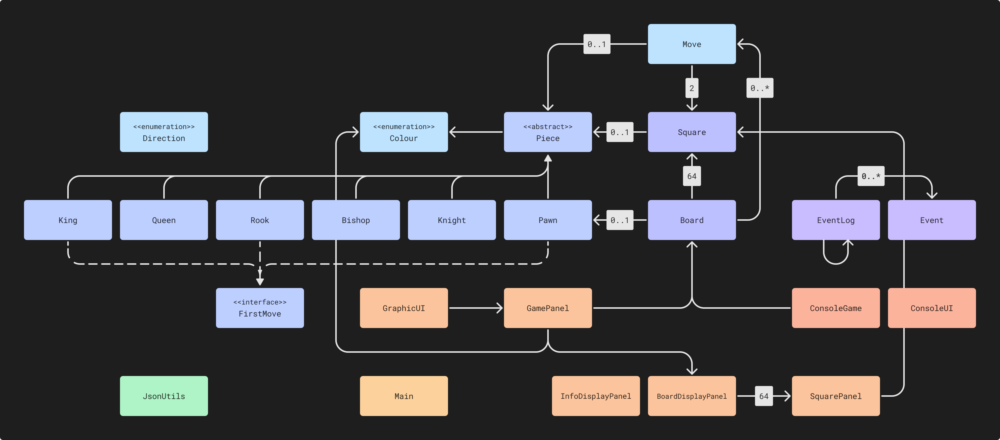

# :chess_pawn: CPSC Program Similar to Chess

## What will the application do?

**CPSC** (CPSC Program Similar to Chess) allows users to play a variant of chess with fog of war. In other words, a 
player can only see squares that a piece of their colour can move to on the next turn.

## Who will use it?

Anyone with some free time and a friend to play with can try **CPSC**, especially those with an interest in chess or
other strategic games.

## Why is this project of interest to you?

Chess has recently undergone an unprecedented rise in popularity, and I wanted to try putting a unique spin on the
classic format. Additionally, from a programming standpoint, I believe that chess is a sufficiently complex game which
will be challenging but rewarding to implement.

---

# :bust_in_silhouette: User Stories

As a user, I want to be able to...

- [x] add a move to a list of prior moves.
- [x] move pieces on the board according to chess rules.
- [x] play against another user on the same device.
- [x] view the current state of the board.
- [x] save a game that is currently in progress.
- [x] load a previously saved game and continue playing.
- [x] copy a game to the clipboard in a PGN-like format.

---

# :mortar_board: Mechanics

1. A square is only visible if a piece of the current player's colour can move to it.
2. Players are not informed of check. The king may move into or be left in check.
3. There is no checkmate. The game ends when a player's king is captured.

---

### Phase 3: Instructions

The GUI has five main elements: the toolbar, board, history panel, chat panel, and continue button. On each player's
turn, they must move a piece on the board, then press the continue button to end their turn with a short delay. Feel
free to test unusual inputs; they should all be handled.

- Add a move to the list of prior moves by interacting with the board.
- Clear the list and start a new game using the first button in the toolbar.
- Save the current game to a file using the second button.
- Load an existing game from a file using the third.
- The visual component is hard to miss.

### Phase 4: Task 2

```text
Thu Apr 06 11:08:54 PDT 2023
Created new list of moves.
Thu Apr 06 11:08:56 PDT 2023
Added new move to list of moves.
Thu Apr 06 11:09:01 PDT 2023
Created new list of moves.
Thu Apr 06 11:09:01 PDT 2023
Converted JSON to list of moves.
Thu Apr 06 11:09:01 PDT 2023
Added new move to list of moves.
Thu Apr 06 11:09:01 PDT 2023
Added new move to list of moves.
Thu Apr 06 11:09:01 PDT 2023
Added new move to list of moves.
Thu Apr 06 11:09:01 PDT 2023
Added new move to list of moves.
Thu Apr 06 11:09:01 PDT 2023
Added new move to list of moves.
Thu Apr 06 11:09:03 PDT 2023
Holy Hell!
Thu Apr 06 11:09:03 PDT 2023
Added new move to list of moves.
Thu Apr 06 11:09:08 PDT 2023
Converted list of moves to JSON.
Thu Apr 06 11:09:10 PDT 2023
Created new list of moves.
```

### Phase 4: Task 3



In chess programming, board representations are broadly categorized as square-centric or piece-centric. The former has 
pieces as members of squares on the board (e.g. `Square --[0..1]--> Piece`). The latter does the opposite, storing
positional information on a per-piece basis.

Internally, **CPSC** uses a square-centric "mailbox" board representation. It is easy to implement and reason about, and
simplifies the process of linking the model and user interface. However, it is less computationally efficient than a 
piece-centric representation, often requiring looping and branching logic for common tasks such as move generation.

One example of a potential large-scale refactor would be to switch to a piece-centric "bitboard" representation. This 
would somewhat decrease the legibility of the code. However, it creates possibilities for the addition of features such 
as a built-in chess engine, which is currently unfeasible due to performance constraints.

Additionally, there are extensive interdependencies between classes of the model, as well as the UI. Some refactoring 
could be done to further reduce the coupling between these classes. In particular, `GamePanel` contains multiple inner
classes which are all dependent on each other, as well as the fields of the outer class. This could be addressed to some
degree using design patterns, or by implementing a proper model-view-controller structure.