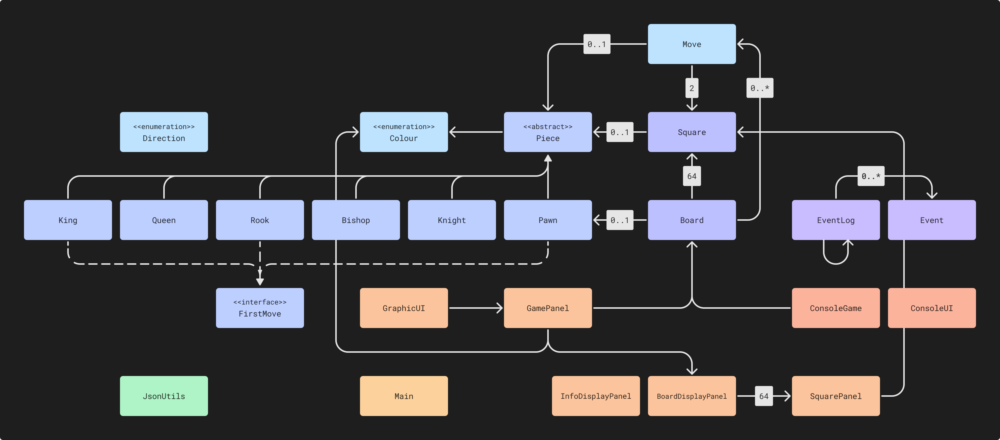

# :chess_pawn: CPSC Program Similar to Chess
**CPSC** (CPSC Program Similar to Chess) is a variant of chess with fog-of-war. A player can only see squares on the 
chessboard that a piece of their colour is currently on, or can move to on the next turn. There is also no check, and 
the game ends when a player's king is captured.

# :point_up: Features
- [x] Local multiplayer.
- [x] Save and load games as `.cpsc` files.
- [x] Copy games to the clipboard in a PGN-like format.

# :tools: Project Structure
